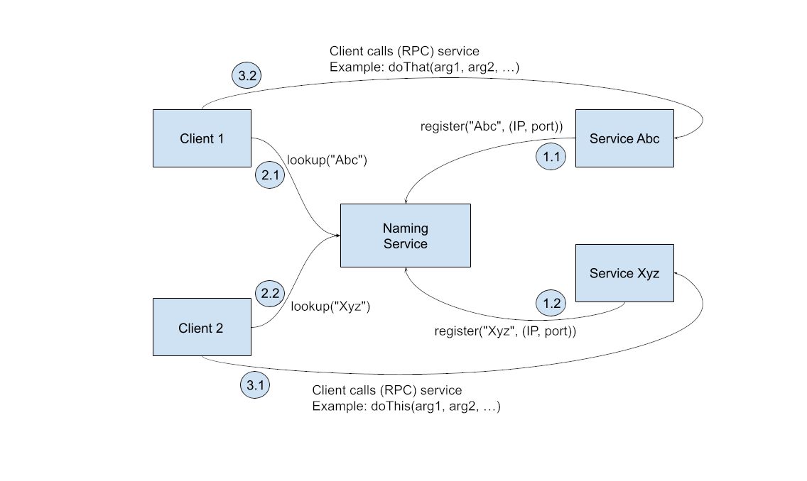

# Naming Service

The objective of this project is to exemplify in a practical and simplistic way the use of a naming service to discover the endpoint of other services that are registered in the naming service. A naming service was developed, an employee service, which performs various operations on an employee, a service that calculates the salary adjustment and two client services that consume these services, by discovering their endpoints in the naming service.

**The naming service has the following operations:**

* register( ) — for an application service to register your name and endpoint / access point (e.g. IP address and port number);
* lookup( ) — for customers to discover the access point for a service from its name; and
* unregister( ) — for a service to remove its registration (typically, before it ceases to exist).

